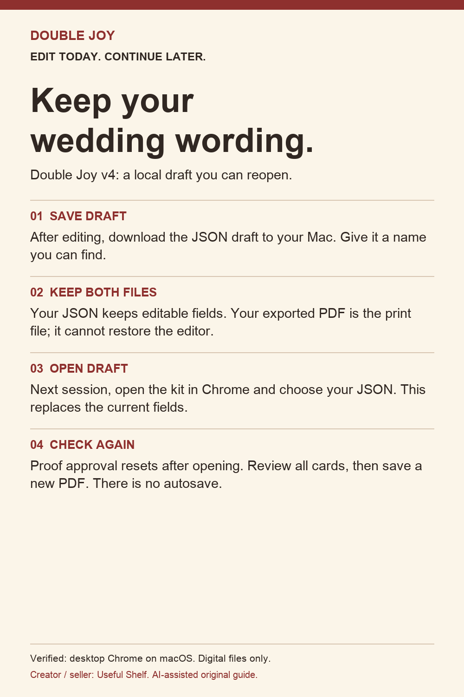
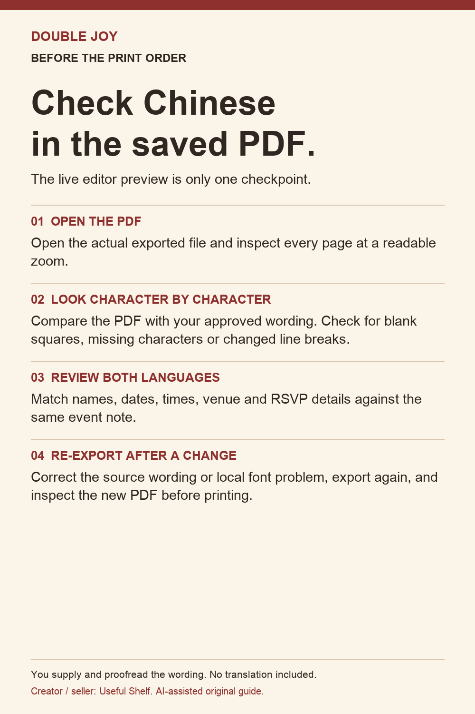
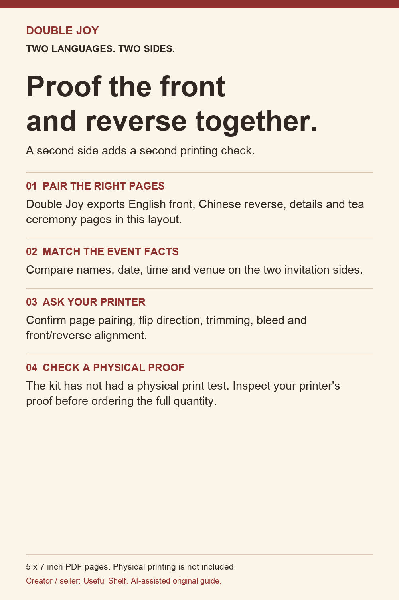
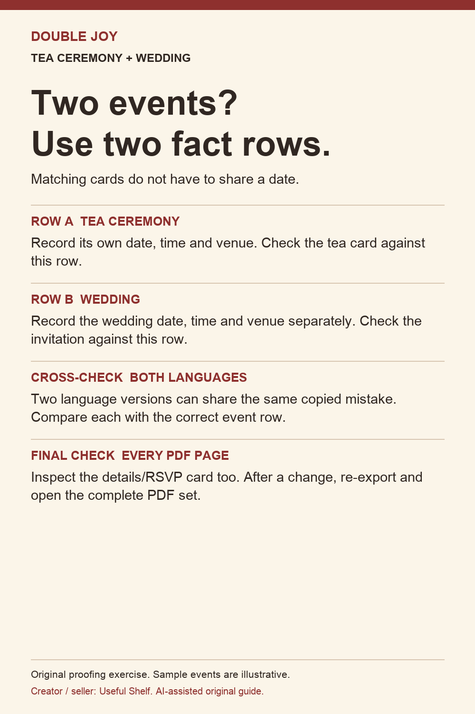
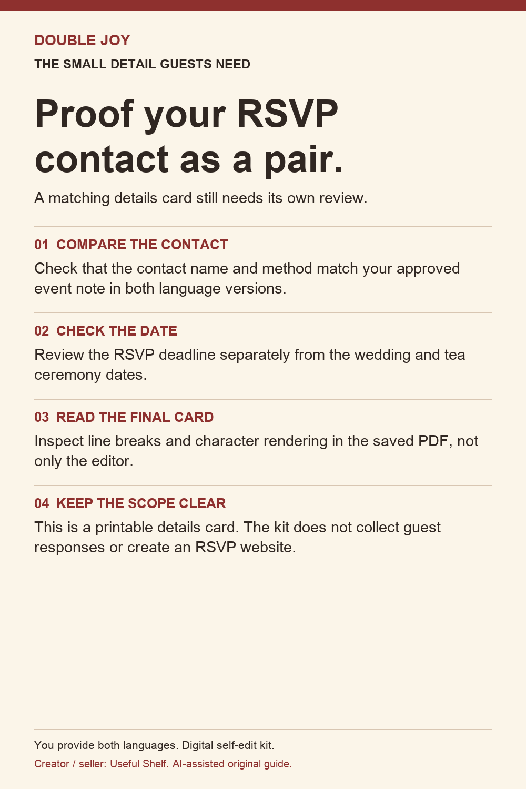
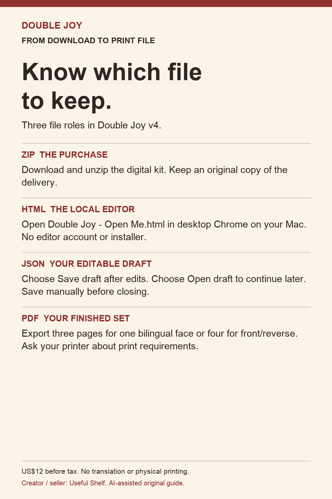

# Double Joy wedding proofing guides

Six original checklists for couples preparing Chinese-English wedding stationery. Creator disclosure: Useful Shelf creates and sells Double Joy. These are our guides, not independent reviews or customer testimonials. AI assisted the original writing and typographic artwork.

The full editable kit is US$12 before tax: [contents and purchase](https://payhip.com/b/dzYnJ?utm_source=github&utm_medium=resource&utm_campaign=doublejoy_24h_oct3&utm_content=proofing_guides). Desktop Chrome on macOS is the verified environment. You provide and proofread both languages. Translation, custom design and physical printing are not included.

This repository contains only public guidance and checklist illustrations; it does not contain the paid editor or delivery ZIP.

## Keep your wedding wording.

- **01  SAVE DRAFT:** After editing, download the JSON draft to your Mac. Give it a name you can find.
- **02  KEEP BOTH FILES:** Your JSON keeps editable fields. Your exported PDF is the print file; it cannot restore the editor.
- **03  OPEN DRAFT:** Next session, open the kit in Chrome and choose your JSON. This replaces the current fields.
- **04  CHECK AGAIN:** Proof approval resets after opening. Review all cards, then save a new PDF. There is no autosave.

## Check Chinese in the saved PDF.

- **01  OPEN THE PDF:** Open the actual exported file and inspect every page at a readable zoom.
- **02  LOOK CHARACTER BY CHARACTER:** Compare the PDF with your approved wording. Check for blank squares, missing characters or changed line breaks.
- **03  REVIEW BOTH LANGUAGES:** Match names, dates, times, venue and RSVP details against the same event note.
- **04  RE-EXPORT AFTER A CHANGE:** Correct the source wording or local font problem, export again, and inspect the new PDF before printing.

## Proof the front and reverse together.

- **01  PAIR THE RIGHT PAGES:** Double Joy exports English front, Chinese reverse, details and tea ceremony pages in this layout.
- **02  MATCH THE EVENT FACTS:** Compare names, date, time and venue on the two invitation sides.
- **03  ASK YOUR PRINTER:** Confirm page pairing, flip direction, trimming, bleed and front/reverse alignment.
- **04  CHECK A PHYSICAL PROOF:** The kit has not had a physical print test. Inspect your printer's proof before ordering the full quantity.

## Two events? Use two fact rows.

- **ROW A  TEA CEREMONY:** Record its own date, time and venue. Check the tea card against this row.
- **ROW B  WEDDING:** Record the wedding date, time and venue separately. Check the invitation against this row.
- **CROSS-CHECK  BOTH LANGUAGES:** Two language versions can share the same copied mistake. Compare each with the correct event row.
- **FINAL CHECK  EVERY PDF PAGE:** Inspect the details/RSVP card too. After a change, re-export and open the complete PDF set.

## Proof your RSVP contact as a pair.

- **01  COMPARE THE CONTACT:** Check that the contact name and method match your approved event note in both language versions.
- **02  CHECK THE DATE:** Review the RSVP deadline separately from the wedding and tea ceremony dates.
- **03  READ THE FINAL CARD:** Inspect line breaks and character rendering in the saved PDF, not only the editor.
- **04  KEEP THE SCOPE CLEAR:** This is a printable details card. The kit does not collect guest responses or create an RSVP website.

## Know which file to keep.

- **ZIP  THE PURCHASE:** Download and unzip the digital kit. Keep an original copy of the delivery.
- **HTML  THE LOCAL EDITOR:** Open Double Joy - Open Me.html in desktop Chrome on your Mac. No editor account or installer.
- **JSON  YOUR EDITABLE DRAFT:** Choose Save draft after edits. Choose Open draft to continue later. Save manually before closing.
- **PDF  YOUR FINISHED SET:** Export three pages for one bilingual face or four for front/reverse. Ask your printer about print requirements.

See the [official free guides](https://double-joy-wedding.dapper-kiwi-8512.chatgpt.site/) and actual product samples before buying. No sales or printing results are claimed.

## Choose a guide for your next step

- [Browse the free stationery worksheet index](guides/free-bilingual-wedding-resources.md) for card recipients, wording, dates and venues.
- [Decide whether you need a static invitation PDF or an online RSVP website](https://telegra.ph/Chinese-English-wedding-invitations-do-you-need-a-printable-PDF-or-an-RSVP-website-10-09).
- [Check the actual PDF received through a messaging app](guides/received-pdf-delivery-checklist.md) before sending the invitation to guests.

## Free proofing forms

- [Bilingual PDF proofing log](guides/free-bilingual-pdf-proofing-log.md)
- [Bilingual wedding PDF printer handoff](guides/bilingual-wedding-pdf-printer-handoff.md)
